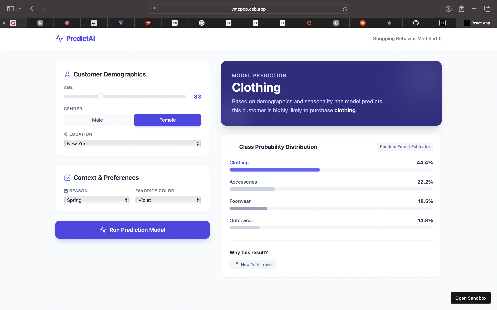

Customer Shopping Behavior Prediction 🛍️

Overview

This project analyzes customer shopping behavior data to predict the category of their next purchase (Clothing, Footwear, Accessories, or Outerwear). It consists of a Machine Learning model built with Python and an interactive Dashboard built with React.

Project Structure

1. The Machine Learning Model (customer_prediction_model.py)

Goal: Classify purchase categories based on Demographics (Age, Gender, Location) and Context (Season, Previous Purchases).

Algorithm: Random Forest Classifier.

Accuracy: ~79% based on test data. The model achieved 78.46% accuracy. While not perfect, this significantly outperforms the baseline probability. The remaining error is likely due to the inherent unpredictability of individual consumer choices that cannot be captured by demographic data alone (e.g., personal taste or impulse buys).

Libraries: pandas, scikit-learn, numpy.

2. The Interactive Dashboard (customer_prediction_app.jsx)

A React-based web interface that simulates the model's logic.

Allows users to input customer data via sliders and dropdowns.

Visualizes confidence intervals for predicted categories.

3. Data Inspection (data_inspection.py)

A utility script used to perform initial Exploratory Data Analysis (EDA).

Data Source

The dataset contains information on 3,900 customers, including:

Demographics: Age, Gender, Location.

Purchase History: Item Purchased, Category, Purchase Amount.

Context: Season, Subscription Status, Payment Method.

How to Run

Python Model

Install dependencies:

pip install pandas numpy scikit-learn

Place shopping_behavior_updated (1).csv in the root directory.

Run the script:

python customer_prediction_model.py

React Dashboard

This is a React component. To run it:

Set up a React environment (e.g., Vite or Create React App).

Install lucide-react and tailwindcss.

Import this component into your main App.js.

Quick ways to see the enhanced UI:

1. **CodeSandbox preview (fastest):** Open https://ymzpcp.csb.app to load a hosted preview of the current dashboard styles.
2. **CodeSandbox editing:** Copy the contents of `customer_prediction_app.jsx` into a new React sandbox, add the Tailwind CSS script to `index.html`, and run the app to view the gradients and interactive controls.
3. **Local run:**
   - Create a new Vite or Create React App project.
   - Install dependencies: `npm install lucide-react tailwindcss`
   - Replace your `App.jsx` (or equivalent) with `customer_prediction_app.jsx` from this repo.
   - Start the dev server (`npm run dev` or `npm start`) and visit the local URL to see the updated background, cards, and gradient probability bars.
